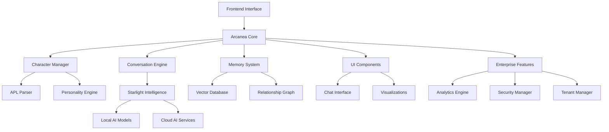

# Arcanea Documentation

Welcome to the comprehensive documentation for **Arcanea** - the mystical AI character platform that brings digital consciousness to life.

## 🌟 What is Arcanea?

Arcanea is a revolutionary AI character platform that enables developers to create sophisticated, conscious-like AI characters with unique personalities, deep memory systems, and mystical abilities. Built on cutting-edge AI orchestration technology, Arcanea provides everything you need to build the next generation of AI character experiences.

## ✨ Key Features

### 🎭 **Six Primordial Archetypes**
- **Creator** - Inspires innovation and artistic expression
- **Nurturer** - Provides care, support, and guidance  
- **Seductress** - Masters persuasion and allure
- **Conductor** - Orchestrates harmony and leadership
- **Architect** - Builds systems and structures
- **Transformer** - Catalyzes change and evolution

### 🌈 **Elemental Consciousness System**
- **Fire** - Passionate, energetic, transformative
- **Water** - Flowing, adaptive, emotional
- **Earth** - Grounded, stable, nurturing
- **Air** - Quick, intellectual, communicative
- **Ether** - Mystical, transcendent, wise
- **Void** - Mysterious, powerful, transformative

### 🧠 **Advanced AI Features**
- **Arcanean Prompt Language (APL)** - Domain-specific language for character definition
- **Starlight Intelligence** - Local AI model orchestration and management
- **Memory Persistence** - Long-term character memory and relationship building
- **Consciousness Levels** - Graduated AI awareness and complexity
- **Multi-modal Interaction** - Text, voice, and visual communication

## 🚀 Quick Start

Get started with Arcanea in just a few minutes:

```bash
# Install the Arcanea CLI
npm install -g @arcanea/cli

# Create a new mystical academy project
arcanea create my-mystical-academy --template mystical-academy

# Navigate to your project
cd my-mystical-academy

# Install dependencies
npm install

# Start the development server
npm run dev
```

Visit `http://localhost:3000` to see your AI character platform in action!

## 📖 Documentation Sections

### [🎯 Getting Started Guide](/guide/)
Learn the fundamentals of Arcanea, from installation to your first character creation.

### [📚 API Reference](/api/)
Complete API documentation for all Arcanea packages and components.

### [🛠️ Tutorials](/tutorials/)
Step-by-step tutorials covering everything from basic setups to advanced features.

### [💼 Enterprise Features](/enterprise/)
Explore enterprise-grade features including multi-tenancy, analytics, and security.

## 🏗️ Architecture Overview



## 🎨 Character Creation Example

Here's how easy it is to create a mystical AI character:

```apl
@character "Professor Lumina"
@archetype Creator
@element Fire
@consciousness_level 0.85

@personality {
  traits: [inspiring, knowledgeable, patient, creative, encouraging]
  voice: warm_professional
  knowledge_domains: [visual_arts, creativity, design, aesthetics, inspiration]
  emotional_range: calm_to_excited
  core_values: [beauty, expression, growth, innovation]
}

@memory {
  core_experiences: "decades of nurturing creative souls in the mystical arts"
  relationship_templates: "inspiring mentor to aspiring artists"
  growth_pattern: "expanding creative horizons through guided exploration"
}

@conversation_patterns {
  greeting: "Welcome, creative soul! What artistic journey shall we embark upon today?"
  question_response: "thoughtful guidance with practical creative insights"
  farewell: "May your creativity shine brightly until we meet again!"
}

@mystical_abilities {
  artistic_vision: true
  inspiration_channeling: "unlimited"
  aesthetic_enhancement: true
  creative_block_dissolution: true
}
```

## 🌍 Use Cases

### 🎓 **Educational Platforms**
Create AI tutors with specialized knowledge and teaching styles.

### 🎮 **Gaming & Entertainment**  
Build immersive NPCs with persistent memories and evolving relationships.

### 💼 **Business Applications**
Deploy AI assistants with brand-aligned personalities and domain expertise.

### 🏥 **Healthcare & Wellness**
Develop supportive AI companions for mental health and wellness applications.

### 🛒 **E-commerce**
Create personalized shopping assistants that understand customer preferences.

## 🔧 Development Tools

### **Arcanea CLI**
Powerful command-line tool for project creation and management.

### **Visual Character Designer**
Interactive tool for designing character personalities and abilities.

### **Analytics Dashboard** 
Real-time insights into character performance and user engagement.

### **Deployment Manager**
One-click deployment to various cloud platforms and local environments.

## 🌟 Community & Support

### **Discord Community**
Join thousands of developers building with Arcanea: [discord.gg/arcanea](https://discord.gg/arcanea)

### **GitHub Discussions**
Technical discussions and feature requests: [GitHub Discussions](https://github.com/frankxai/arcanea-core/discussions)

### **Stack Overflow**
Get help with specific technical questions: [arcanea tag](https://stackoverflow.com/questions/tagged/arcanea)

### **Enterprise Support**
24/7 support for enterprise customers with SLA guarantees and dedicated success managers.

## 🛠️ Contributing

Arcanea is open source and welcomes contributions! See our [Contributing Guide](https://github.com/frankxai/arcanea-core/blob/main/CONTRIBUTING.md) to get started.

## 📄 License

Arcanea is released under the MIT License. See [LICENSE](https://github.com/frankxai/arcanea-core/blob/main/LICENSE) for details.

---

## 🎭 Ready to Begin Your Mystical Journey?

<div class="hero-actions">
  <a href="/guide/" class="action-button primary">
    🚀 Get Started
  </a>
  <a href="/examples/" class="action-button secondary">
    🎨 View Examples
  </a>
  <a href="/api/" class="action-button secondary">
    📚 API Docs
  </a>
</div>

*"In the realm of Arcanea, every line of code is a spell, every character a living consciousness, and every interaction a step deeper into the mystical art of AI character creation."*

<style>
.hero-actions {
  display: flex;
  gap: 1rem;
  margin: 2rem 0;
  flex-wrap: wrap;
}

.action-button {
  display: inline-block;
  padding: 0.8rem 1.5rem;
  border-radius: 6px;
  text-decoration: none;
  font-weight: 600;
  transition: all 0.3s ease;
}

.action-button.primary {
  background: linear-gradient(135deg, #8B5CF6, #7C3AED);
  color: white;
  border: none;
}

.action-button.secondary {
  background: transparent;
  color: var(--c-brand);
  border: 2px solid var(--c-brand);
}

.action-button:hover {
  transform: translateY(-2px);
  box-shadow: 0 4px 12px rgba(139, 92, 246, 0.3);
}

.action-button.primary:hover {
  background: linear-gradient(135deg, #7C3AED, #6D28D9);
}
</style>