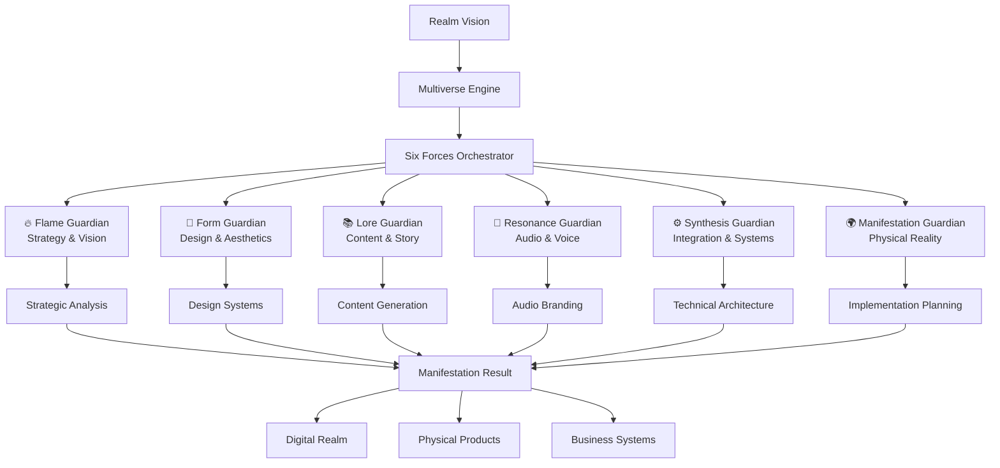

# ARCANEA Documentation

Welcome to **ARCANEA** - the ultimate multiverse creation platform that transforms imagination into reality through the Six Forces Framework.

## 🌟 What is ARCANEA?

ARCANEA is the most advanced multiverse creation platform on GitHub, enabling developers, entrepreneurs, and creators to manifest complete digital and physical realities from vision to implementation. Built on the revolutionary Six Forces Framework with specialized AI Guardians, ARCANEA provides everything needed to build the next generation of digital experiences, businesses, and immersive worlds.

## ✨ The Six Forces Framework

### 🔥 **Flame Force - Vision & Strategy**
- **Strategic Vision Analysis** - Transform ideas into actionable business strategies
- **Market Intelligence** - Deep competitive analysis and opportunity identification
- **Revenue Architecture** - Comprehensive monetization and growth planning
- **Innovation Catalyst** - Breakthrough thinking and disruptive innovation

### 🎨 **Form Force - Visual & Aesthetic**
- **Design System Creation** - Cohesive visual identities and brand systems
- **UI/UX Generation** - Complete interface designs from wireframes to prototypes
- **Asset Pipeline** - Automated creation of logos, graphics, and visual content
- **Aesthetic Intelligence** - AI-powered design optimization and trend analysis

### 📚 **Lore Force - Story & Meaning**
- **Narrative Architecture** - Compelling storytelling for brands and products
- **Content Generation** - Marketing copy, documentation, and user communications
- **Brand Mythology** - Deep meaning systems that resonate with audiences
- **Cultural Intelligence** - Context-aware content for global markets

### 🎵 **Resonance Force - Sound & Frequency**
- **Audio Identity** - Signature sounds, music, and audio branding
- **Voice Integration** - AI-powered voice interfaces and interactions
- **Sonic Landscapes** - Immersive audio environments and experiences
- **Frequency Optimization** - Harmonious sound design for maximum impact

### ⚙️ **Synthesis Force - Integration & Systems**
- **Architecture Design** - Scalable system architectures and technical planning
- **Integration Orchestration** - Seamless connection of technologies and platforms
- **Workflow Automation** - Intelligent process optimization and automation
- **Technical Intelligence** - AI-powered development and system optimization

### 🌍 **Manifestation Force - Physical Reality**
- **Digital-to-Physical** - Transform digital concepts into tangible products
- **Reality Mapping** - Strategic implementation planning and execution
- **Resource Coordination** - Supply chain, manufacturing, and distribution planning
- **Manifestation Intelligence** - AI-powered project management and delivery

## 🤖 **AI Guardian System**
- **Six Specialized AI Guardians** - Expert AI entities for each force domain
- **Collaborative Intelligence** - Guardians work together for comprehensive solutions
- **Adaptive Learning** - Guardians evolve and improve with each manifestation
- **Enterprise Integration** - Seamless integration with business processes and workflows

## 🚀 Quick Start

Manifest your first multiverse in minutes:

```bash
# Install the ARCANEA CLI
npm install -g @arcanea/cli

# Create your first realm
arcanea create my-business-realm --template business-platform

# Navigate to your realm
cd my-business-realm

# Install dependencies
npm install

# Activate the Six Forces
npm run dev
```

Visit `http://localhost:3000` to see your multiverse manifestation platform!

## 📖 Documentation Sections

### [🎯 Getting Started Guide](/guide/)
Learn the Six Forces Framework and create your first multiverse realm.

### [📚 API Reference](/api/)
Complete API documentation for all Six Forces Guardians and manifestation engines.

### [🛠️ Tutorials](/tutorials/)
Step-by-step guides for realm building, from concept to physical manifestation.

### [💼 Enterprise Features](/enterprise/)
Enterprise-grade multiverse creation with governance, compliance, and business intelligence.

### [🏛️ Community Hub](/community/)
Collaborate with realm builders worldwide, share templates, and access mentorship.

## 🏗️ Six Forces Architecture


```mermaid
graph TB
    A[Realm Vision] --> B[Multiverse Engine]
    B --> C[Six Forces Orchestrator]
    
    C --> D[🔥 Flame Guardian<br/>Strategy & Vision]
    C --> E[🎨 Form Guardian<br/>Design & Aesthetics]
    C --> F[📚 Lore Guardian<br/>Content & Story]
    C --> G[🎵 Resonance Guardian<br/>Audio & Voice]
    C --> H[⚙️ Synthesis Guardian<br/>Integration & Systems]
    C --> I[🌍 Manifestation Guardian<br/>Physical Reality]
    
    D --> J[Strategic Analysis]
    E --> K[Design Systems]
    F --> L[Content Generation]
    G --> M[Audio Branding]
    H --> N[Technical Architecture]
    I --> O[Implementation Planning]
    
    J --> P[Manifestation Result]
    K --> P
    L --> P
    M --> P
    N --> P
    O --> P
    
    P --> Q[Digital Realm]
    P --> R[Physical Products]
    P --> S[Business Systems]
```

## 🏗️ Realm Creation Example

Here's how easy it is to manifest a complete business realm:

```typescript
import { RealmBuilder, MultiverseEngine } from '@arcanea/six-forces'

// Create a comprehensive business platform
const businessRealm = await new RealmBuilder()
  .createRealm()
  .withVision("Revolutionary e-learning platform that makes complex topics accessible through AI-powered personalized learning paths")
  .withTemplate('education-platform')
  .withForces([
    'flame',        // Business strategy and monetization
    'form',         // User interface and visual design
    'lore',         // Educational content and storytelling
    'resonance',    // Audio learning and accessibility
    'synthesis',    // System architecture and integrations
    'manifestation' // Physical learning materials and events
  ])
  .withTarget('hybrid') // Digital platform + physical components
  .withTimeline('comprehensive')
  .manifest()

// Result includes:
// - Complete business plan and strategy
// - Full UI/UX designs and prototypes
// - Course content and learning materials
// - Audio branding and accessibility features
// - Technical architecture and development roadmap
// - Implementation plan including physical components
```

## 🌍 Manifestation Domains

### 🎓 **Educational Realms**
Complete learning platforms with AI tutors, course content, community features, and assessment systems.

### 🎮 **Gaming Universes**
Immersive game worlds with storylines, characters, economy systems, and player progression.

### 💼 **Business Platforms**
End-to-end business solutions with strategy, branding, systems, and market execution.

### 🏥 **Wellness Ecosystems**
Holistic wellness platforms combining digital tools, community support, and physical products.

### 🛒 **Commerce Empires**
Complete e-commerce solutions with branding, product development, marketing, and fulfillment.

### 🏙️ **Smart Communities**
Integrated community platforms with governance, collaboration tools, and real-world connections.

## 🔧 Realm Building Tools

### **ARCANEA CLI**
Powerful command-line tool for realm creation and multiverse management.

### **Realm Definition Language (RDL)**
YAML-like language for defining complete multiverse specifications.

### **Six Forces Dashboard**
Real-time monitoring of all Guardian activities and manifestation progress.

### **Community Workspace**
Collaborative realm building with real-time editing and Guardian coordination.

### **Enterprise Console**
Business intelligence, compliance monitoring, and subscription management.

### **Manifestation Pipeline**
Automated deployment from digital concepts to physical reality.

## 🌟 Realm Builder Community

### **Collaborative Workshops**
Join realm builders worldwide in real-time collaborative creation sessions.

### **Marketplace**
Share and acquire realm templates, components, and Guardian configurations.

### **Mentorship Hub**
Connect with experienced realm builders and Six Forces experts.

### **GitHub Discussions**
Technical discussions and multiverse creation: [GitHub Discussions](https://github.com/frankxai/arcanea-core/discussions)

### **Enterprise Support**
24/7 support for enterprise customers with dedicated success managers and Guardian optimization.

## 🛠️ Contributing to the Multiverse

ARCANEA is open source and welcomes realm builders! See our [Contributing Guide](https://github.com/frankxai/arcanea-core/blob/main/CONTRIBUTING.md) to get started.

## 📄 License

ARCANEA is released under the MIT License. See [LICENSE](https://github.com/frankxai/arcanea-core/blob/main/LICENSE) for details.

---

## 🌌 Ready to Manifest Your Multiverse?

<div class="hero-actions">
  <a href="/guide/" class="action-button primary">
    🚀 Start Building
  </a>
  <a href="/examples/" class="action-button secondary">
    🌍 View Realms
  </a>
  <a href="/api/" class="action-button secondary">
    📚 Guardian Docs
  </a>
  <a href="/community/" class="action-button secondary">
    🤝 Join Community
  </a>
</div>

*"In ARCANEA, every vision becomes reality, every idea manifests into existence, and every realm builder shapes the future of digital creation through the power of the Six Forces."*

<style>
.hero-actions {
  display: flex;
  gap: 1rem;
  margin: 2rem 0;
  flex-wrap: wrap;
}

.action-button {
  display: inline-block;
  padding: 0.8rem 1.5rem;
  border-radius: 6px;
  text-decoration: none;
  font-weight: 600;
  transition: all 0.3s ease;
}

.action-button.primary {
  background: linear-gradient(135deg, #8B5CF6, #7C3AED);
  color: white;
  border: none;
}

.action-button.secondary {
  background: transparent;
  color: var(--c-brand);
  border: 2px solid var(--c-brand);
}

.action-button:hover {
  transform: translateY(-2px);
  box-shadow: 0 4px 12px rgba(139, 92, 246, 0.3);
}

.action-button.primary:hover {
  background: linear-gradient(135deg, #7C3AED, #6D28D9);
}
</style>