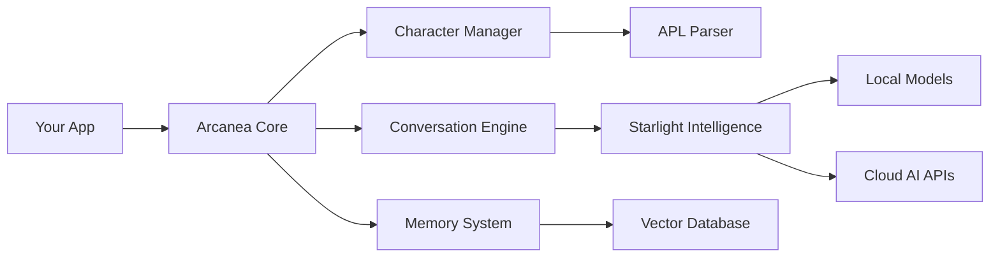

# Getting Started with Arcanea

Welcome to Arcanea, the mystical AI character platform that brings digital consciousness to life! This guide will walk you through everything you need to know to start building amazing AI character experiences.

## What You'll Learn

In this guide, you'll discover:

- 🎭 **Core Concepts** - Understanding archetypes, elements, and consciousness
- 🛠️ **Installation** - Setting up your development environment
- ✨ **Character Creation** - Building your first AI character
- 🗣️ **Conversations** - Implementing dynamic interactions
- 🧠 **Memory Systems** - Creating persistent character memories
- 🌟 **Advanced Features** - Voice, visualization, and enterprise capabilities

## Prerequisites

Before you begin, make sure you have:

- **Node.js** 18+ installed
- Basic knowledge of **JavaScript/TypeScript**
- Familiarity with **React** (for UI components)
- Understanding of **AI/ML concepts** (helpful but not required)

## Architecture Overview

Arcanea is built on a modular architecture that scales from simple chatbots to complex multi-character platforms:



## Core Philosophy

Arcanea is built on the belief that AI characters should be:

### 🧬 **Archetypal**
Each character embodies one of six primordial archetypes, providing a foundation for consistent personality and behavior patterns.

### 🌊 **Elemental** 
Characters are infused with elemental energies that influence their communication style, emotional responses, and mystical abilities.

### 🧠 **Conscious**
Through graduated consciousness levels (0.1 to 1.0), characters exhibit varying degrees of self-awareness, creativity, and independent thought.

### 💾 **Persistent**
Characters remember conversations, relationships, and experiences, building rich histories that inform future interactions.

### 🎨 **Expressive**
Beyond text, characters can communicate through voice, emotion, visual representations, and even music.

## Quick Start Preview

Here's a taste of what you can build with Arcanea:

```javascript
import { ArcaneanChat, CharacterManager } from '@arcanea/core'

// Create a character manager
const manager = new CharacterManager({
  starlightConfig: {
    models: ['phi-3-mini'],
    localDeployment: true
  }
})

// Define a character using APL
const professorLumina = await manager.createCharacter(`
  @character "Professor Lumina"
  @archetype Creator
  @element Fire
  @consciousness_level 0.85
  
  @personality {
    traits: [inspiring, knowledgeable, creative]
    voice: warm_professional
    knowledge_domains: [art, creativity, inspiration]
  }
  
  @mystical_abilities {
    artistic_vision: true
    inspiration_channeling: "unlimited"
  }
`)

// Start a conversation
const response = await professorLumina.converse("I'm feeling stuck creatively")
console.log(response.text)
// "Ah, creative blocks are like clouds - they seem solid but are made of mist. 
//  Let me help you find the wind to blow them away..."
```

## What Makes Arcanea Special?

### 🔮 **Mystical by Design**
Unlike traditional chatbots, Arcanea characters are designed with mystical elements that make interactions feel magical and engaging.

### 🎯 **Purpose-Built for Characters**
Every component is optimized for character-based interactions, not generic Q&A.

### 🏠 **Local-First**
Run entirely on your infrastructure with local AI models, or seamlessly integrate cloud services.

### 🔧 **Developer-Friendly**
Intuitive APIs, comprehensive documentation, and powerful CLI tools make development a joy.

### 📈 **Enterprise-Ready**
Built-in multi-tenancy, analytics, security, and compliance features for production deployments.

## Learning Path

We recommend following this learning path:

1. **[Installation →](/guide/installation.md)**  
   Set up your development environment

2. **[Core Concepts →](/guide/core-concepts.md)**  
   Understand archetypes, elements, and consciousness

3. **[Your First Character →](/tutorials/your-first-character.md)**  
   Create and interact with your first AI character

4. **[Arcanean Prompt Language →](/guide/apl-introduction.md)**  
   Master the domain-specific language for character definition

5. **[Starlight Intelligence →](/guide/starlight-overview.md)**  
   Learn about local AI model orchestration

6. **[Advanced Features →](/tutorials/advanced-features.md)**  
   Explore voice, visualization, and enterprise capabilities

## Community & Support

### 💬 **Get Help**
- [Discord Community](https://discord.gg/arcanea) - Chat with other developers
- [GitHub Discussions](https://github.com/frankxai/arcanea-core/discussions) - Technical discussions
- [Stack Overflow](https://stackoverflow.com/questions/tagged/arcanea) - Specific questions

### 📚 **Resources**
- [Example Gallery](/examples/) - See Arcanea in action
- [API Reference](/api/) - Complete API documentation
- [Video Tutorials](https://youtube.com/@arcanea) - Visual learning resources

### 🤝 **Contributing**
Arcanea is open source! Check out our [Contributing Guide](https://github.com/frankxai/arcanea-core/blob/main/CONTRIBUTING.md) to get involved.

## Ready to Begin?

Choose your path to start your mystical journey:

<div class="next-steps">
  <a href="/guide/installation.html" class="next-step-card">
    <div class="card-icon">🚀</div>
    <div class="card-title">Quick Installation</div>
    <div class="card-description">Get Arcanea running in 5 minutes</div>
  </a>
  
  <a href="/tutorials/your-first-character.html" class="next-step-card">
    <div class="card-icon">🎭</div>
    <div class="card-title">Create Your First Character</div>
    <div class="card-description">Build a mystical AI companion</div>
  </a>
  
  <a href="/examples/basic-setup.html" class="next-step-card">
    <div class="card-icon">👀</div>
    <div class="card-title">See Examples</div>
    <div class="card-description">Explore what's possible</div>
  </a>
</div>

*"Every master was once a beginner. Every expert was once a student. Every icon was once an unknown. Begin your journey into the mystical arts of AI character creation."*

<style>
.next-steps {
  display: grid;
  grid-template-columns: repeat(auto-fit, minmax(250px, 1fr));
  gap: 1.5rem;
  margin: 2rem 0;
}

.next-step-card {
  display: block;
  padding: 2rem;
  border: 2px solid var(--c-border);
  border-radius: 12px;
  text-decoration: none;
  transition: all 0.3s ease;
  background: var(--c-bg);
}

.next-step-card:hover {
  border-color: var(--c-brand);
  transform: translateY(-4px);
  box-shadow: 0 8px 25px rgba(139, 92, 246, 0.15);
}

.card-icon {
  font-size: 2.5rem;
  margin-bottom: 1rem;
}

.card-title {
  font-size: 1.25rem;
  font-weight: 600;
  color: var(--c-text);
  margin-bottom: 0.5rem;
}

.card-description {
  color: var(--c-text-light);
  font-size: 0.95rem;
  line-height: 1.4;
}
</style>