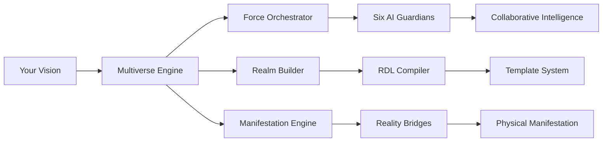

# Getting Started with ARCANEA

Welcome to ARCANEA, the ultimate multiverse creation platform that transforms imagination into reality through the Six Forces Framework! This guide will walk you through everything you need to know to start manifesting complete digital and physical realms.

## What You'll Learn

In this guide, you'll discover:

- 🎆 **Six Forces Framework** - Understanding Flame, Form, Lore, Resonance, Synthesis, and Manifestation
- 🛠️ **Installation** - Setting up your multiverse creation environment
- 🌍 **Realm Building** - Creating your first complete realm
- 🤖 **AI Guardians** - Working with specialized AI entities for each force
- 🏗️ **RDL Language** - Defining realms with Realm Definition Language
- 🌟 **Enterprise Features** - Community, collaboration, and business intelligence

## Prerequisites

Before you begin, make sure you have:

- **Node.js** 18+ installed
- Basic knowledge of **JavaScript/TypeScript**
- Familiarity with **YAML** (for RDL definitions)
- Understanding of **business concepts** (helpful for realm strategy)
- **Creative vision** (the most important prerequisite!)

## Architecture Overview

ARCANEA is built on the Six Forces architecture that scales from simple digital projects to complete multiverse manifestations:


```mermaid
graph LR
    A[Your Vision] --> B[Multiverse Engine]
    B --> C[Force Orchestrator]
    B --> D[Realm Builder]
    B --> E[Manifestation Engine]
    
    C --> F[Six AI Guardians]
    D --> G[RDL Compiler]
    E --> H[Reality Bridges]
    
    F --> I[Collaborative Intelligence]
    G --> J[Template System]
    H --> K[Physical Manifestation]
```

## Core Philosophy

ARCANEA is built on the belief that multiverse creation should be:

### 🔥 **Comprehensive**
Every realm addresses all six forces - strategy, design, content, audio, systems, and physical manifestation.

### 🤖 **AI-Powered**
Specialized AI Guardians provide expert-level guidance and automation for each force domain.

### 🌍 **Reality-Spanning**
Seamless integration between digital experiences and physical world implementations.

### 🤝 **Collaborative**
Real-time collaboration with other realm builders, AI Guardians, and community expertise.

### 🎯 **Results-Oriented**
Every manifestation produces tangible, valuable outcomes that can be deployed and monetized.

## Quick Start Preview

Here's a taste of what you can build with ARCANEA:

```typescript
import { MultiverseEngine, RealmBuilder } from '@arcanea/six-forces'

// Initialize the multiverse engine
const engine = new MultiverseEngine({
  guardians: 'all', // Activate all six AI Guardians
  collaboration: true,
  enterprise: true
})

// Manifest a complete business realm
const fitnessApp = await engine.manifestRealm({
  vision: "AI-powered fitness platform that adapts to each user's unique body and goals",
  template: 'wellness-platform',
  forces: ['flame', 'form', 'lore', 'resonance', 'synthesis', 'manifestation'],
  target: 'hybrid', // Digital app + physical products
  timeline: 'comprehensive'
})

// Result includes complete business plan, UI designs, 
// content strategy, audio branding, technical architecture,
// and physical product manifestation plan
console.log(fitnessApp.strategy.revenueProjection)
// "$2.4M ARR by year 2 through freemium model with premium features..."

console.log(fitnessApp.implementation.nextSteps)
// ["Set up development environment", "Implement core tracking features", 
//  "Design personalization engine", "Launch MVP with beta users"...]
```

## What Makes ARCANEA Special?

### 🔥 **Six Forces Mastery**
The only platform that systematically addresses all aspects of creation from vision to physical reality.

### 🤖 **AI Guardian Intelligence**
Specialized AI entities that provide expert-level guidance in strategy, design, content, audio, systems, and manifestation.

### 🌍 **Complete Manifestation**
Go beyond digital-only solutions to create integrated experiences that span digital and physical realms.

### 🤝 **Collaborative Creation**
Real-time collaboration with other builders, AI Guardians, and community experts.

### 📈 **Enterprise-Grade**
Built-in governance, compliance, business intelligence, and monetization for serious business applications.

## Learning Path

We recommend following this learning path:

1. **[Installation →](/guide/installation.md)**  
   Set up your multiverse creation environment

2. **[Six Forces Framework →](/guide/six-forces-overview.md)**  
   Understand the foundation of multiverse creation

3. **[Your First Realm →](/tutorials/your-first-realm.md)**  
   Manifest your first complete digital realm

4. **[Realm Definition Language →](/guide/rdl-introduction.md)**  
   Master the YAML-like language for realm specification

5. **[AI Guardian Collaboration →](/guide/guardian-overview.md)**  
   Learn to work with specialized AI entities

6. **[Community & Enterprise →](/tutorials/advanced-features.md)**  
   Explore collaboration, marketplace, and business features

## Community & Support

### 💬 **Get Help**
- [Realm Builder Community](/community/) - Collaborate with other multiverse creators
- [GitHub Discussions](https://github.com/frankxai/arcanea-core/discussions) - Technical discussions
- [Mentorship Hub](/community/mentorship) - Connect with Six Forces experts

### 📚 **Resources**
- [Realm Gallery](/examples/) - See complete multiverse creations
- [Guardian API Reference](/api/) - Complete AI Guardian documentation
- [Template Marketplace](/community/marketplace) - Share and acquire realm components

### 🤝 **Contributing**
ARCANEA is open source! Check out our [Contributing Guide](https://github.com/frankxai/arcanea-core/blob/main/CONTRIBUTING.md) to get involved.

## Ready to Begin?

Choose your path to start manifesting multiverses:

<div class="next-steps">
  <a href="/guide/installation.html" class="next-step-card">
    <div class="card-icon">🚀</div>
    <div class="card-title">Quick Installation</div>
    <div class="card-description">Get ARCANEA running in 5 minutes</div>
  </a>
  
  <a href="/tutorials/your-first-realm.html" class="next-step-card">
    <div class="card-icon">🌍</div>
    <div class="card-title">Create Your First Realm</div>
    <div class="card-description">Manifest a complete multiverse</div>
  </a>
  
  <a href="/examples/realm-showcase.html" class="next-step-card">
    <div class="card-icon">👀</div>
    <div class="card-title">Explore Realms</div>
    <div class="card-description">See what's possible with Six Forces</div>
  </a>
</div>

*"Every master was once a beginner. Every expert was once a student. Every icon was once an unknown. Begin your journey into the art of multiverse creation through the Six Forces Framework."*

<style>
.next-steps {
  display: grid;
  grid-template-columns: repeat(auto-fit, minmax(250px, 1fr));
  gap: 1.5rem;
  margin: 2rem 0;
}

.next-step-card {
  display: block;
  padding: 2rem;
  border: 2px solid var(--c-border);
  border-radius: 12px;
  text-decoration: none;
  transition: all 0.3s ease;
  background: var(--c-bg);
}

.next-step-card:hover {
  border-color: var(--c-brand);
  transform: translateY(-4px);
  box-shadow: 0 8px 25px rgba(139, 92, 246, 0.15);
}

.card-icon {
  font-size: 2.5rem;
  margin-bottom: 1rem;
}

.card-title {
  font-size: 1.25rem;
  font-weight: 600;
  color: var(--c-text);
  margin-bottom: 0.5rem;
}

.card-description {
  color: var(--c-text-light);
  font-size: 0.95rem;
  line-height: 1.4;
}
</style>